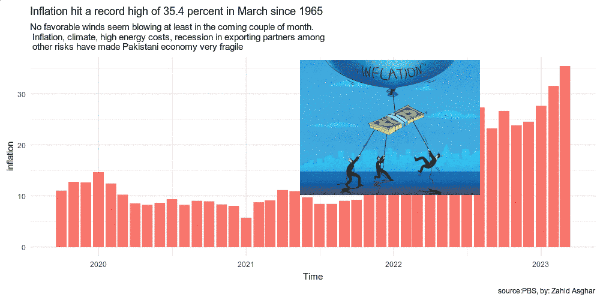
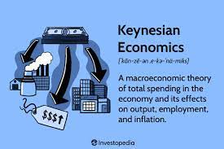

```{r, include=FALSE}
knitr::opts_chunk$set(results = 'asis',
                      echo = FALSE,
                      warning = FALSE,
                      tidy = FALSE,
                      message = FALSE,
                      fig.align = 'center',
                      out.width = "100%")
options(knitr.table.format = "html") 
```

```{r myplot, include=FALSE}
svg('myplot.svg')
plot(iris$Sepal.Length, iris$Sepal.Width)
dev.off()
```

# Why School of Economics

- A Opportunity for highly motivated researchers in economics 

- Limited Seats with 100% seats on merit  

- Large number of scholarships

# Main areas:

-   Trade and International Economics 

-   Development Economics 

-   Islamic Economics 

-   Globalization and Development 

-   Big Data and Machine Learning in Economics 

-   Applied Econometrics 

-   Health Economics

```{r, include=FALSE}
knitr::write_bib(c('posterdown', 'rmarkdown','pagedown'), 'packages.bib')
```

{width="800}

{width="1200"}

{width="1200"}


{width="1200"}
